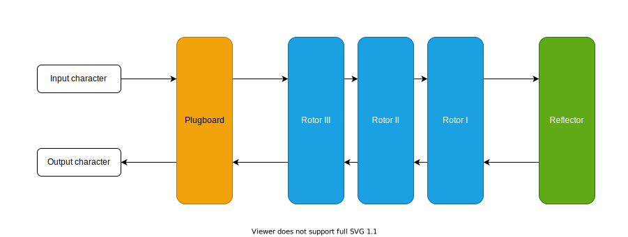

# enigma-haskell

A haskell implementation of the [Enigma machine](https://en.wikipedia.org/wiki/Enigma_machine)

Written mainly to try out the [freer-simple](https://hackage.haskell.org/package/freer-simple) effects library

## Process overview

1. A button is pressed

2. The machine steps (rotates) the rotors

   2.1 - Rotor I (right, fast) is stepped unconditionally

   2.2 - Rotor II (middle) is stepped only if Rotor I or itself is currently in a turnover position. This is called a 'double step'.

   -The double step is a solution to a mechanical limitation specific to the M3 model. If Rotor II remained in turnover position until the next time Rotor I reached a turnover position, Rotor III would also be stepped on every iteration until that point (which would reduce the total number of unique states). More information [here](http://www.intelligenia.org/downloads/rotors1.pdf).

   2.3 - Rotor III (left, slow) is stepped only if Rotor II is currently in a turnover position

3. The current passes through the components

   3.1 - Plugboard (forward)

   3.2 - Rotor I (forward)

   3.3 - Rotor II (forward)

   3.4 - Rotor III (forward)

   3.5 - Reflector

   3.6 - Rotor III (backward)

   3.7 - Rotor II (backward)

   3.8 - Rotor I (backward)

   3.9 - Plugboard (backward)

4. A lightbulb signifying the output character lights up
   - the output character is always different for the input character
