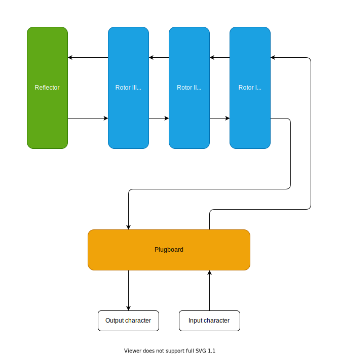

# enigma-haskell

A haskell implementation of the [Enigma machine](https://en.wikipedia.org/wiki/Enigma_machine)

Written mainly to try out the [freer-simple](https://hackage.haskell.org/package/freer-simple) effects library

## Process overview

## Components

### Plugboard

